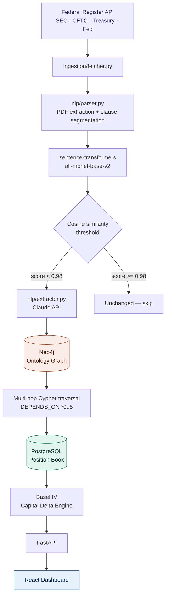
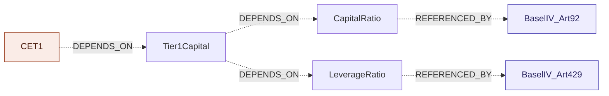

# DeltaReg

**Regulatory Change Intelligence Engine**
 
An automated compliance pipeline that ingests live financial regulations, detects semantic changes between rule versions, builds a knowledge graph of regulatory concept dependencies, and quantifies the capital impact on a bank's portfolio positions.
 
---
 
## The Problem
 
When a financial regulator publishes a rule amendment, compliance teams manually read the document, compare it against the prior version, trace which downstream rules are affected, and cross-reference the impact against the institution's trading book. This process takes weeks sometimes longer and is error-prone.
 
DeltaReg is meant to automate the full workflow:

```
New regulation published
        ↓
What changed semantically?
        ↓
Which downstream rules does that cascade into?
        ↓
Which of our positions are affected?
        ↓
How much additional capital do we need?
```


## Architecture
 

---

## Pipeline Layers
 
### 1. Ingestion ingestion/fetcher.py
 
Polls the Federal Register API for newly published rules across SEC, CFTC, Treasury, and the Federal Reserve. Filters by document type and date range, then normalizes the response into a flat schema.

### 2. Semantic Diff nlp/parser.py
 
Extracts text from regulation PDFs, segments into clauses, and embeds each clause into a 768-dimensional vector. Compares every clause in the new version against every clause in the old version via cosine similarity.
 
The key insight: a text diff catches word changes, a semantic diff catches meaning changes. A regulator can rewrite an entire paragraph with different words while preserving the legal meaning, text diff flags it as a major change, cosine similarity correctly identifies it as equivalent

| Similarity score | Classification |
|---|---|
| ≥ 0.98 | Unchanged — skip |
| 0.70 – 0.98 | Modified — flag for LLM analysis |
| < 0.70 | New clause — no equivalent in prior version |
 
### 3. Structured Extraction nlp/extractor.py
 
Flagged clauses are sent to the Claude API with a JSON schema prompt. Returns machine-readable metadata: 
```json
{
  "change_type": "capital_requirement",
  "what_changed": "Minimum capital increased from 8% to 10% of RWA",
  "direction": "more_restrictive",
  "affected_instruments": ["uncleared swaps", "derivatives"],
  "effective_date": null,
  "magnitude": "high"
}
```
 
A second method, extract_concepts(), reads regulatory document titles and extracts the underlying concepts and their dependency relationships, this is what auto-populates the ontology graph without manual annotation.

### 4. Ontology Graph graph/ontology.py
 
The core intelligence layer. Regulatory concepts are stored as nodes in Neo4j with `DEPENDS_ON` relationships modeling how definitions cascade.
 

 
A change to `CET1` cascades through `Tier1Capital` into both `CapitalRatio` and `LeverageRatio`, surfacing two affected rules that a keyword search would never find.
 
```cypher
MATCH (changed:Concept {name: $concept})
      <-[:DEPENDS_ON*0..5]-(downstream:Concept)
      <-[:REFERENCES]-(rule:Rule)
RETURN DISTINCT rule.id, rule.regulator, downstream.name
```
 
The *0..5 variable-length traversal is what makes cascade detection possible — one query, any depth, milliseconds.

### 5. Portfolio Impact portfolio/mapper.py
 
Cross-references the affected instrument types against a PostgreSQL position book. Uses fuzzy matching to bridge the gap between LLM-extracted natural language labels (`"uncleared swaps"`) and internal schema naming (`uncleared_swap`).
 
Capital delta is computed under the Basel IV standardized approach:
 
```
ΔRWA     = notional × (new_risk_weight − old_risk_weight)
ΔCapital = ΔRWA × 0.08
```
 
### 6. API & Dashboard api/main.py`, `frontend/
 
FastAPI exposes three endpoints:
 
| Endpoint | Method | Purpose |
|---|---|---|
| `/impact` | POST | Run full impact analysis on a clause change |
| `/run-pipeline` | POST | Trigger live ingestion and ontology expansion |
| `/graph-data` | GET | Return current graph state for visualization |
 
The React dashboard renders the cascade path, LLM extraction output, and per-desk capital exposure in real time.
 
---
 
## Results
 
Ontology built from live regulatory data : no manual annotation:
 
| Metric | Value |
|---|---|
| Regulatory concepts | 227 |
| Concept dependencies | 389 |
| Rules ingested | 28 |
| Throughput | 8.7s per document |
 
Semantic diff classifier: evaluated on a held-out hand-labeled test set:
 
| Metric | Validation | Held-out |
|---|---|---|
| Precision | 0.714 | 0.562 |
| Recall | 1.000 | 0.818 |
| F1 | 0.833 | 0.667 |
 
Threshold was tuned on the validation split and evaluated on a separate held-out set to avoid optimism bias. The classifier is deliberately tuned toward recall — in a compliance context, a missed regulatory change carries materially higher cost than a false alarm. Flagged clauses are routed to an LLM for the final determination, so the threshold acts as a recall-oriented filter rather than the classifier of record.

---

## Tech Stack
 
| Layer | Technology |
|---|---|
| Ingestion | Python, httpx, Federal Register API |
| PDF parsing | PyMuPDF |
| Embeddings | sentence-transformers (`all-mpnet-base-v2`) |
| LLM extraction | Claude API |
| Knowledge graph | Neo4j, Cypher |
| Position store | PostgreSQL, psycopg2 |
| Evaluation | scikit-learn |
| API | FastAPI, Pydantic, Uvicorn |
| Frontend | React |
| Infrastructure | Docker |
 
---

 
## Limitations
 
- The position book is seeded with synthetic data. A production deployment would integrate with an institution's position management system.
- Ingestion currently covers US federal regulators via the Federal Register API. International regulators (ESMA, FCA, BIS, APRA, MAS) each require a dedicated scraper.
- The evaluation set is 40 hand-labeled clause pairs. A larger benchmark would tighten the confidence interval on the reported metrics.

## Setup
 
### Prerequisites
 
- Docker
- Python 3.10+
- Node.js 18+
### 1. Start the databases
 
```bash
docker run -d --name deltareg-neo4j \
  -p 7474:7474 -p 7687:7687 \
  -e NEO4J_AUTH=neo4j/yourpassword \
  neo4j:5.18
 
docker run -d --name deltareg-postgres \
  -p 5432:5432 \
  -e POSTGRES_USER=deltareg \
  -e POSTGRES_PASSWORD=yourpassword \
  -e POSTGRES_DB=deltareg \
  postgres:16
```
 
### 2. Configure environment
 
Create a `.env` file in the project root:
 
```env
ANTHROPIC_API_KEY=your-key-here
REGULATIONS_API_KEY=your-key-here
NEO4J_URI=bolt://localhost:7687
NEO4J_USER=neo4j
NEO4J_PASSWORD=yourpassword
POSTGRES_HOST=localhost
POSTGRES_PORT=5432
POSTGRES_DB=deltareg
POSTGRES_USER=deltareg
POSTGRES_PASSWORD=yourpassword
```
 
Get a free Regulations.gov API key at [api.data.gov/signup](https://api.data.gov/signup).
 
### 3. Install dependencies
 
```bash
pip install -r requirements.txt
cd frontend && npm install
```
 
### 4. Seed the position book
 
```bash
cd portfolio && python3 mapper.py
```
 
### 5. Run the pipeline
 
```bash
python3 pipeline.py
```
 
### 6. Start the services
 
```bash
# Terminal 1 — backend
cd api && uvicorn main:app --reload
 
# Terminal 2 — frontend
cd frontend && npm start
```
 